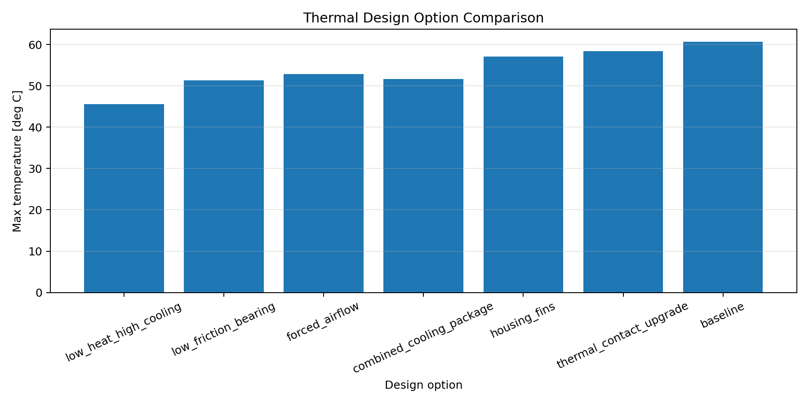

# Thermal Engineering Automation Portfolio

My engineering focus is rotating machinery and mechanical components. This portfolio demonstrates how Python can automate thermal simulation, thermal design review, CAE post-processing, and optimization workflows.

The projects are fictional and public-safe, but they are structured around realistic engineering tasks: estimating heat generation, predicting temperature response, identifying thermal bottlenecks, reviewing Nastran thermal results, comparing mitigation options, and generating reports.

---

## Portfolio Theme

```text
Rotating machinery thermal problem
        ↓
Heat generation and transient temperature prediction
        ↓
Thermal path and bottleneck analysis
        ↓
Thermal CAE result review and reporting
        ↓
Design improvement and optimization
```

The goal is to show practical Python automation for thermal engineering, not only isolated calculations.

---

## Resume

[Download Resume (PDF)](resume/Masatake_Kadono_Resume.pdf)

---

## Projects

| Project | Preview | Role in the workflow |
|---|---|---|
| [Coaster Bearing Thermal Lab](coaster-bearing-thermal-lab/) | [](coaster-bearing-thermal-lab/) | Simulates bearing friction heat generation, transient temperature rise, cooling/friction mitigation, and thermal optimization for a rotating wheel assembly. |
| [Thermal Resistance Network Optimizer](thermal-resistance-network-optimizer/) | [](thermal-resistance-network-optimizer/) | Solves a steady-state thermal resistance network, ranks thermal bottlenecks, and compares cooling or heat-reduction design options. |
| [Nastran Thermal Design Review Automation Tool](automated-cae-design-review-tool/) | [](automated-cae-design-review-tool/) | Imports Nastran-style BDF/F06 thermal results, screens hot cases, evaluates temperature limits and exceeded-area ratios, and generates review reports. |

---

## Skills Demonstrated

- Thermal engineering analysis with Python
- Friction heat generation modeling
- Transient thermal response simulation
- Steady-state thermal resistance network solving
- Thermal bottleneck detection
- Thermal CAE result post-processing
- Nastran BDF/F06-style thermal result import
- Temperature limit checks and hot-case screening
- Mitigation comparison and design optimization
- CSV, Markdown, Excel, and PNG report generation
- Basic automated tests for engineering calculations

---

## Quick Start

Clone the repository:

```bash
git clone https://github.com/Masatarou0109/Portfolio_Mechanical_Engineer.git
cd Portfolio_Mechanical_Engineer
```

Run the bearing thermal simulation:

```bash
cd coaster-bearing-thermal-lab
python3 -m venv .venv
source .venv/bin/activate
pip install -r requirements.txt
python src/main.py
python src/mitigation_study.py
python src/optimization_ga.py
python -m unittest discover -s tests
```

Run the thermal resistance network optimizer:

```bash
cd ../thermal-resistance-network-optimizer
python3 -m venv .venv
source .venv/bin/activate
pip install -r requirements.txt
python src/main.py
python -m unittest discover -s tests
```

Run the Nastran thermal design review demo:

```bash
cd ../automated-cae-design-review-tool
python3 -m venv .venv
source .venv/bin/activate
pip install -r requirements.txt
python src/run_review.py
python -m unittest discover -s tests
```

---

## Repository Layout

```text
coaster-bearing-thermal-lab/
  Bearing heat generation, transient thermal response, mitigation study, and GA optimization

thermal-resistance-network-optimizer/
  Thermal path modeling, bottleneck detection, and cooling option comparison

automated-cae-design-review-tool/
  Nastran thermal result import, hot-case screening, and report generation
```

---

## Notes

These projects are portfolio demonstrations. They are not certified design tools. Real engineering decisions require validation of assumptions, heat-transfer coefficients, boundary conditions, material data, load cases, mesh quality, solver convergence, test data, supplier data, and applicable safety standards.
