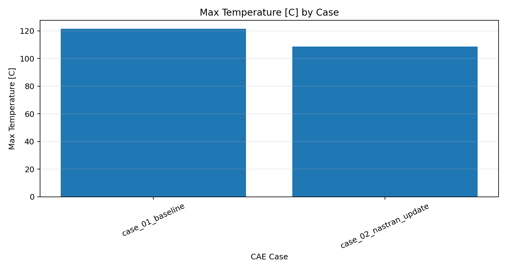
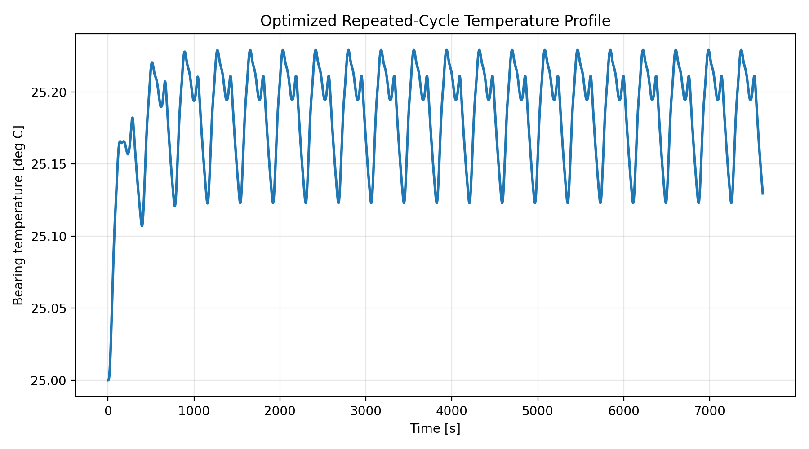

# Mechanical Engineering Python Portfolio

This repository contains engineering-focused Python projects for CAE post-processing, thermal simulation, design review automation, visualization, and optimization.

The projects are fictional and public-safe, but they are structured to demonstrate practical engineering workflows: importing analysis data, calculating design metrics, comparing alternatives, generating reports, and communicating results clearly.

---

## Projects

| Project | Preview | What it demonstrates |
|---|---|---|
| [Nastran CAE Design Review Automation Tool](automated-cae-design-review-tool/) | [](automated-cae-design-review-tool/) | Imports Nastran-style BDF/F06 results, calculates engineering review metrics, classifies design cases as `OK`, `Warning`, or `NG`, and generates CSV, Excel, Markdown, and PNG reports. |
| [Coaster Bearing Thermal Lab](coaster-bearing-thermal-lab/) | [](coaster-bearing-thermal-lab/) | Models bearing friction heat generation, predicts temperature response, compares mitigation scenarios, and performs catalog-based genetic optimization. |

---

## Skills Highlighted

- Mechanical engineering analysis with Python
- CAE result post-processing
- Nastran BDF/F06-style result import
- Thermal response simulation
- Design criteria judgement and reporting
- Data visualization with Matplotlib
- CSV and Excel report generation
- Genetic algorithm optimization
- Reproducible project structure and basic tests

---

## Quick Start

Clone the repository and enter one of the project folders:

```bash
git clone https://github.com/Masatarou0109/Portfolio_Mechanical_Engineer.git
cd Portfolio_Mechanical_Engineer
```

Run the Nastran CAE design review demo:

```bash
cd automated-cae-design-review-tool
python3 -m venv .venv
source .venv/bin/activate
pip install -r requirements.txt
python src/run_review.py
python -m unittest discover -s tests
```

Run the bearing thermal simulation demo:

```bash
cd ../coaster-bearing-thermal-lab
python3 -m venv .venv
source .venv/bin/activate
pip install -r requirements.txt
python src/main.py
python src/mitigation_study.py
python src/optimization_ga.py
python -m unittest discover -s tests
```

---

## Repository Layout

```text
automated-cae-design-review-tool/
  Nastran result import, design judgement, and report generation

coaster-bearing-thermal-lab/
  Bearing heat generation, thermal response simulation, and GA optimization
```

---

## Notes

These projects are portfolio demonstrations. They are not certified design tools. Real engineering decisions require validation of assumptions, boundary conditions, material data, load cases, mesh quality, solver convergence, supplier data, and applicable safety standards.
