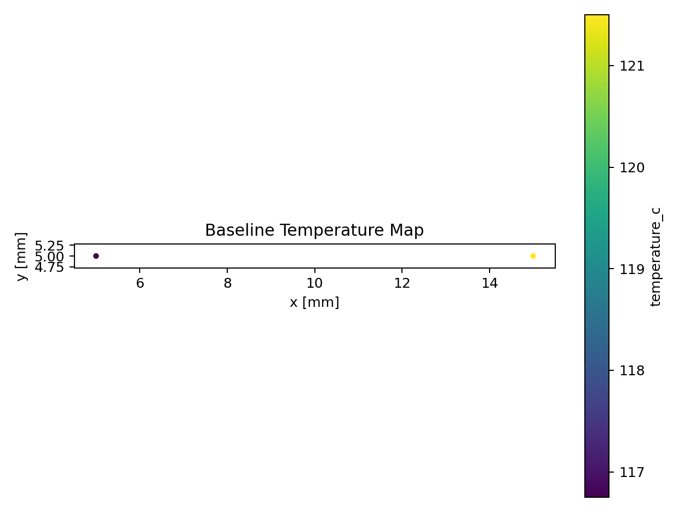
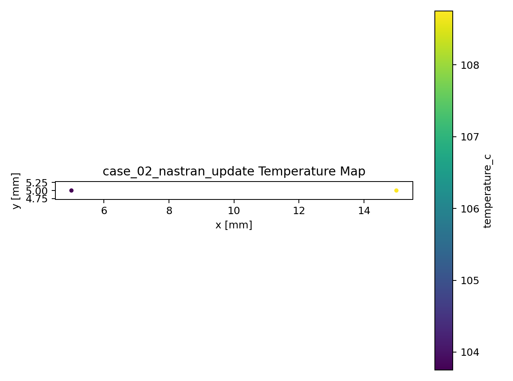
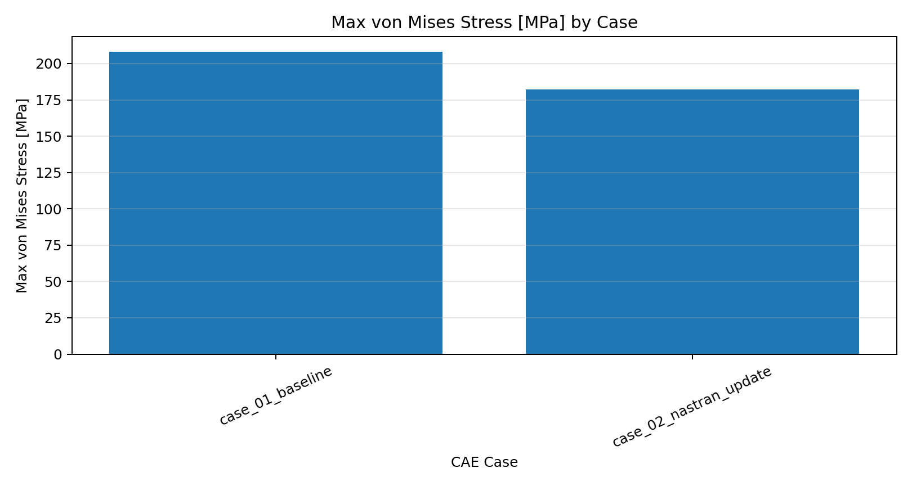

# Nastran CAE Design Review Automation Tool

Automated post-processing and design judgement reporting for Nastran analysis results.

This Python tool imports Nastran analysis results, converts them into engineering review metrics, and automatically generates comparison tables, design judgements, reports, and plots.


---

## Overview

CAE tools are excellent at displaying contour plots, but engineering review work often still requires manual post-processing: multi-case comparison, exceeded-area ratio, improvement rate, safety factor checks, OK/Warning/NG judgement, and report creation.

This tool is designed to convert Nastran results into decision-ready engineering review outputs, not only to visualize analysis results.

---

## Key Features

- Imports shell mesh geometry from Nastran BDF files.
- Supports `GRID`, `CTRIA3`, and `CQUAD4` entries.
- Imports displacement, temperature, von Mises stress, and heat flux from F06/PCH-style text results.
- Calculates element centroids and shell element areas.
- Summarizes maximum temperature, maximum stress, maximum displacement, and area-weighted averages by design case.
- Calculates exceeded-area ratios against engineering limits.
- Calculates improvement rates from a baseline design case.
- Classifies each case as `OK`, `Warning`, or `NG`.
- Generates CSV, Excel, Markdown, and PNG outputs automatically.

---

## Result Examples

### Baseline Temperature Map



### Recommended Case Temperature Map



### Stress Comparison



---

## Workflow

```text
Nastran BDF + F06/PCH results
        ↓
Geometry and result import
        ↓
Derived engineering metrics
        ↓
Design criteria judgement
        ↓
CSV / Excel / Markdown / PNG reports
```

---

## Nastran Input

To use Nastran results, create `data/nastran_cases.csv`.

```csv
case_id,case_description,bdf_path,result_path
case_01_baseline,Nastran baseline demo,nastran_demo/demo_model.bdf,nastran_demo/case_01_baseline.f06
case_02_nastran_update,Nastran improved demo,nastran_demo/demo_model.bdf,nastran_demo/case_02_nastran_update.f06
```

Sample files are included as:

```text
data/nastran_cases.example.csv
data/nastran_demo/demo_model.bdf
data/nastran_demo/case_01_baseline.f06
data/nastran_demo/case_02_nastran_update.f06
```

Supported Nastran-style inputs:

| Input | Imported data |
|---|---|
| BDF | `GRID`, `CTRIA3`, `CQUAD4`, element centroid, shell area, element connectivity |
| F06/PCH text | Displacement vector, grid point temperature, element von Mises stress, element heat flux |

F06/PCH text formatting can vary depending on the Nastran version and output settings. This portfolio implementation targets representative text tables. Direct OP2 binary import would be a natural extension using `pyNastran`.

---

## CSV Demo Input

If `data/nastran_cases.csv` does not exist, the tool falls back to the sample CSV workflow using `data/case_*.csv`.

| Column | Meaning |
|---|---|
| `case_id` | Analysis case name |
| `case_description` | Case description |
| `element_id` | Element ID |
| `x_mm`, `y_mm` | Element centroid coordinates |
| `area_mm2` | Element area |
| `stress_vm_mpa` | von Mises stress |
| `displacement_mm` | Displacement |
| `temperature_c` | Temperature |
| `heat_flux_w_mm2` | Heat flux |
| `block_id` | Coarse averaging region ID |

The sample CSV data and Nastran demo data are synthetic and do not contain confidential CAE results.

---

## How to Run

Install dependencies:

```bash
pip install -r requirements.txt
```

Run the default CSV demo:

```bash
python src/run_review.py
```

Run the Nastran demo:

```bash
cp data/nastran_cases.example.csv data/nastran_cases.csv
python src/run_review.py
```

---

## Outputs

| Output | Description |
|---|---|
| `outputs/design_review_report.xlsx` | Excel design review report |
| `outputs/design_review_report.md` | Markdown design review summary |
| `outputs/case_summary.csv` | Case-level summary |
| `outputs/risk_elements.csv` | Elements exceeding engineering criteria |
| `outputs/block_average_error_summary.csv` | Heat-flux block averaging error summary |
| `outputs/case_comparison_temperature.png` | Maximum temperature comparison |
| `outputs/case_comparison_stress.png` | Maximum stress comparison |
| `outputs/case_comparison_displacement.png` | Maximum displacement comparison |
| `outputs/case_comparison_exceeded_area.png` | Temperature exceeded-area comparison |

---

## Design Criteria

Judgement criteria are managed in `config/design_criteria.json`.

Example:

```json
{
  "temperature_limit_c": 118.0,
  "temperature_warning_c": 110.0,
  "stress_allowable_mpa": 200.0,
  "stress_yield_mpa": 320.0,
  "displacement_limit_mm": 0.235,
  "minimum_safety_factor": 1.5
}
```

For real projects, these values must be replaced with project-specific limits based on material properties, design standards, internal criteria, and test conditions.

---

## Portfolio Highlights

This project demonstrates a workflow that converts CAE results into engineering decisions.

It shows the ability to:

- Import Nastran analysis results with Python.
- Convert raw result tables into design review metrics.
- Evaluate risk using exceeded-area ratios and area-weighted averages, not only maximum values.
- Quantify improvements against a baseline design.
- Apply consistent design criteria across multiple cases.
- Automatically generate Excel reports and visual summaries.

---

## Notes

This tool is a portfolio demonstration. For real engineering decisions, mesh quality, boundary conditions, material properties, unit systems, loading conditions, contact settings, and solver convergence must be verified separately.
