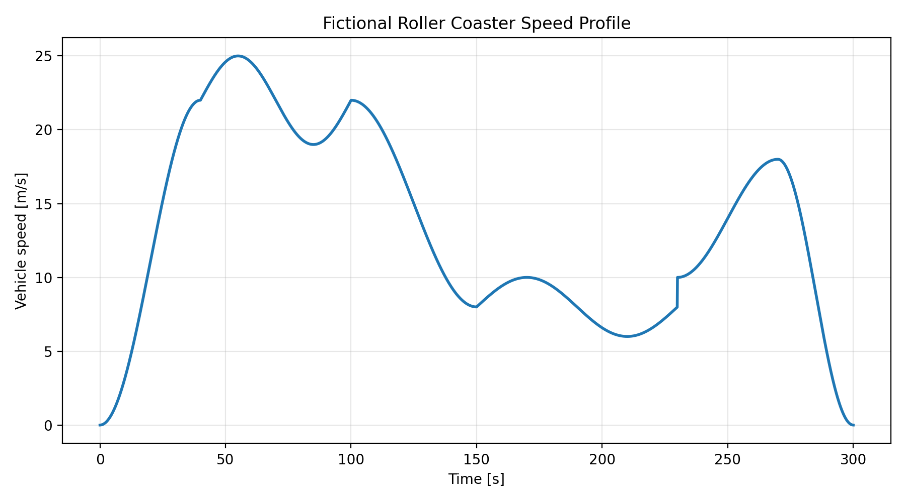
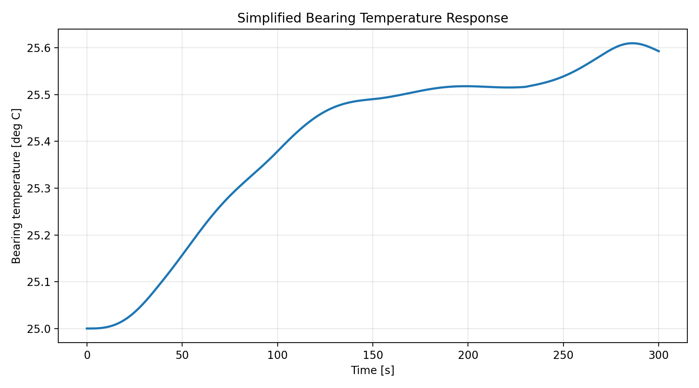
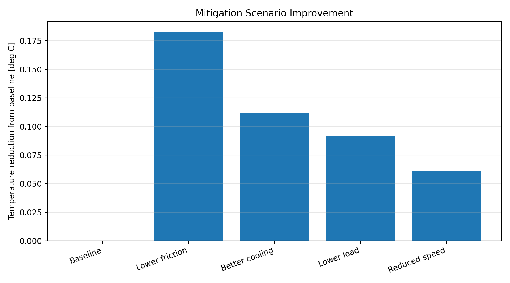
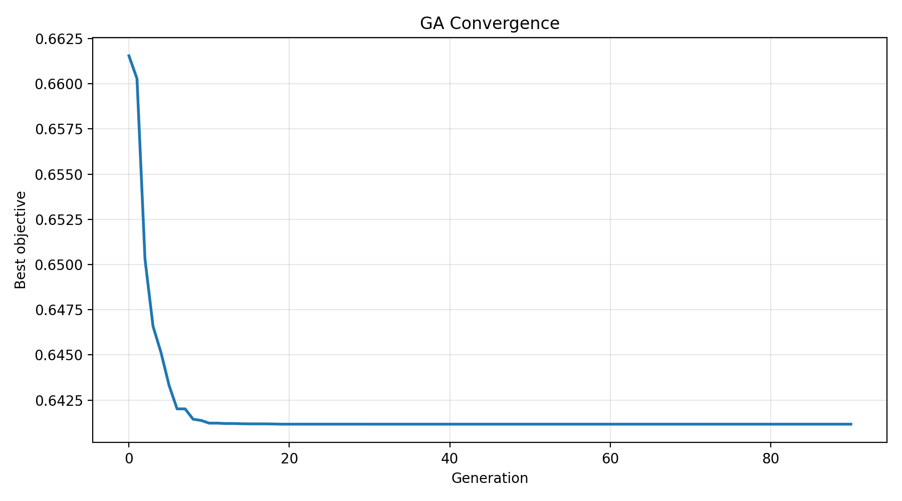

# Coaster Bearing Thermal Lab

架空ジェットコースター車両の車輪軸受を対象に、走行速度、車輪回転数、摩擦発熱、温度上昇、熱リスク低減策を評価する Python プロジェクトです。

このプロジェクトの目的は、連続運転時に軸受温度がどの程度上昇するかを簡易熱モデルで予測し、対策案比較と GA による設計探索を行うことです。

> Note: This is a fictional, public-safe model for portfolio use. It is not a certified roller coaster design tool.

## Project Highlights

- 架空速度プロファイルから車輪回転数を計算
- 軸受荷重、摩擦トルク、摩擦発熱を計算
- 集中熱容量モデルで軸受温度応答を予測
- 摩擦低減、放熱改善、荷重低減、速度低減の対策案を比較
- GA により、軸受タイプ、潤滑剤、車輪材質、車輪半径、冷却風量、運転間隔を探索
- 結果を PNG グラフと CSV で出力

## Engineering Problem

ローラーコースター車輪軸受は、走行中の回転摩擦によって発熱します。連続運転で温度上昇が蓄積すると、潤滑性能、軸受寿命、内部すきま、信頼性に影響する可能性があります。

本プロジェクトでは、次の問いを簡易モデルで扱います。

- 標準条件で軸受温度はどの程度上昇するか
- 摩擦低減や放熱改善はどの程度効くか
- コストや制約を考慮した場合、どの設計案がバランス良いか

## Model Flow

```text
speed profile
→ wheel angular speed
→ wheel load
→ bearing friction torque
→ frictional heat generation
→ bearing temperature response
→ mitigation comparison / GA optimization
```

## Governing Equations

Wheel angular speed:

```text
omega = v / r_wheel
```

Bearing friction torque:

```text
M_f = mu * F_wheel * r_bearing
```

Frictional heat generation:

```text
Q_dot = M_f * omega
```

Lumped thermal response:

```text
C_th * dT/dt = Q_dot - hA * (T - T_ambient)
```

The temperature response is integrated with an explicit Euler method.

## Repository Structure

```text
data/
  design_parameters.json          Baseline simulation parameters
src/
  main.py                         Baseline simulation entry point
  speed_profile.py                Speed profile and wheel rpm calculation
  bearing_friction.py             Wheel load, friction torque, heat generation
  thermal_model.py                Lumped thermal model
  mitigation_study.py             Fixed mitigation scenario comparison
  optimization_ga.py              Catalog-based genetic optimization
  visualization.py                Plot helpers
figures/                          Generated PNG figures
outputs/                          Generated CSV outputs
docs/                             Portfolio notes
```

## How to Run

Install dependencies:

```bash
pip install -r requirements.txt
```

Run the baseline simulation:

```bash
python3 src/main.py
```

Run mitigation scenario comparison:

```bash
python3 src/mitigation_study.py
```

Run GA optimization:

```bash
python3 src/optimization_ga.py
```

If Matplotlib reports a config/cache warning, run with:

```bash
MPLCONFIGDIR=.matplotlib python3 src/optimization_ga.py
```

## Baseline Result

Current baseline output:

```text
Wheel load per wheel: 2451.7 N
Bearing friction torque: 0.0919 N*m
Maximum speed: 25.00 m/s
Maximum wheel speed: 1591.5 rpm
Maximum heat generation: 15.32 W
Maximum bearing temperature: 25.61 deg C
```

Baseline figures:





## Mitigation Study

The mitigation study compares fixed design changes:

| Scenario | Meaning |
|---|---|
| Baseline | Original condition |
| Lower friction | 30% lower equivalent friction |
| Better cooling | 50% higher heat dissipation |
| Lower load | 15% lower wheel load |
| Reduced speed | 10% lower speed profile |

Current mitigation results:

| Scenario | Max temperature [deg C] | Temperature rise [deg C] | Max heat [W] |
|---|---:|---:|---:|
| Baseline | 25.61 | 0.610 | 15.32 |
| Lower friction | 25.43 | 0.427 | 10.73 |
| Better cooling | 25.50 | 0.498 | 15.32 |
| Lower load | 25.52 | 0.518 | 13.02 |
| Reduced speed | 25.55 | 0.549 | 13.79 |

The absolute temperature difference is small, so the most readable comparison is the reduction from baseline:



## GA Optimization

`optimization_ga.py` performs a catalog-based genetic optimization. The design variables are:

| Variable | Type |
|---|---|
| Bearing type | Categorical |
| Lubricant type | Categorical |
| Wheel material | Categorical |
| Wheel radius | Continuous |
| Cooling airflow | Continuous |
| Cycle gap | Continuous |

The objective function is:

```text
objective = normalized_temperature_rise + 0.08 * design_cost + constraint_penalty
```

This means the GA searches for a design that:

- reduces bearing temperature rise
- avoids excessive design or operating cost
- avoids violating temperature, bearing load, and lubricant margin constraints

Current GA settings:

```text
population size: 72
generations: 90
elite count: 5
tournament size: 3
mutation rate: 0.20
repeated operation: 20 cycles
temperature limit: 27.0 deg C
```

Current best GA result:

```text
Best max temperature: 25.23 deg C
Best temperature rise: 0.229 deg C
Best objective: 0.6412
Design cost index: 4.987
Bearing: Low-friction sealed ball bearing
Lubricant: Low-viscosity synthetic grease
Wheel material: Steel-core polyurethane wheel
Wheel radius: 0.190 m
Cooling airflow: 3.74 m/s
Cycle gap: 80.9 s
```

GA convergence:



Optimized repeated-cycle temperature profile:


## Output Files

```text
outputs/mitigation_study_results.csv
outputs/ga_convergence_history.csv
outputs/ga_final_population.csv
```

`ga_final_population.csv` is useful for comparing not only the best design, but also other near-optimal candidates.

## Assumptions

- The coaster and speed profile are fictional.
- Wheel load is assumed to be statically and evenly distributed.
- Dynamic load transfer, curves, vibration, and impact loads are not modeled.
- Bearing friction is represented by a simplified equivalent friction coefficient.
- Thermal behavior is represented by a lumped capacitance model.
- Bearing, lubricant, and wheel material catalogs use fictional values.
- Cooling airflow is modeled with a simplified heat-dissipation multiplier.
- The GA objective weights are engineering assumptions, not validated design criteria.

## Limitations

This project is not a replacement for:

- detailed bearing selection
- supplier catalog verification
- lubrication analysis
- finite element thermal analysis
- experimental validation
- roller coaster safety design or certification

The value of the project is in showing a complete engineering-analysis workflow:

```text
problem definition
→ physical modeling
→ numerical simulation
→ mitigation comparison
→ optimization
→ visualization and reporting
```

## Technologies

- Python
- NumPy
- Matplotlib
- CSV output
- Genetic algorithm implemented from scratch

## References

- Schaeffler — Friction and increases in temperature  
  https://medias.schaeffler.us/en/knowledge-center/rolling-bearings/friction-and-increases-in-temperature
- NumPy Documentation  
  https://numpy.org/doc/
- Matplotlib Documentation  
  https://matplotlib.org/stable/index.html
